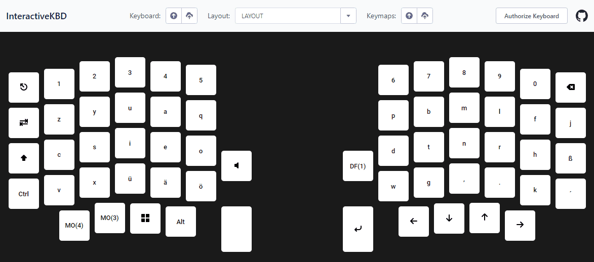

# Interactive KBD



**...or try it yourself: [Demo](https://dawosch.github.io/interactive-kbd)**

# What is Interactive KBD

You have a new keyboard with different layers and you don't know what you are pressing?

With `Interactive KBD` you now see what you are pressing in realtime.

# Requirements

1. You need a keyboard with [QMK Firmware](https://qmk.fm).

2. Then you need to enable the `RAW Hid` feature: [How to enable the Raw Hid feature](https://docs.qmk.fm/features/rawhid).

3. Paste the following code into your `keymap.c` file:

```c
bool process_record_user(uint16_t keycode, keyrecord_t *record) {
    uint8_t msg[32];
    memset(msg, 0, 32);
    msg[0] = record->event.key.col;
    msg[1] = record->event.key.row;
    msg[2] = record->event.pressed;
    raw_hid_send(msg, 32);
    return true;
};
```
